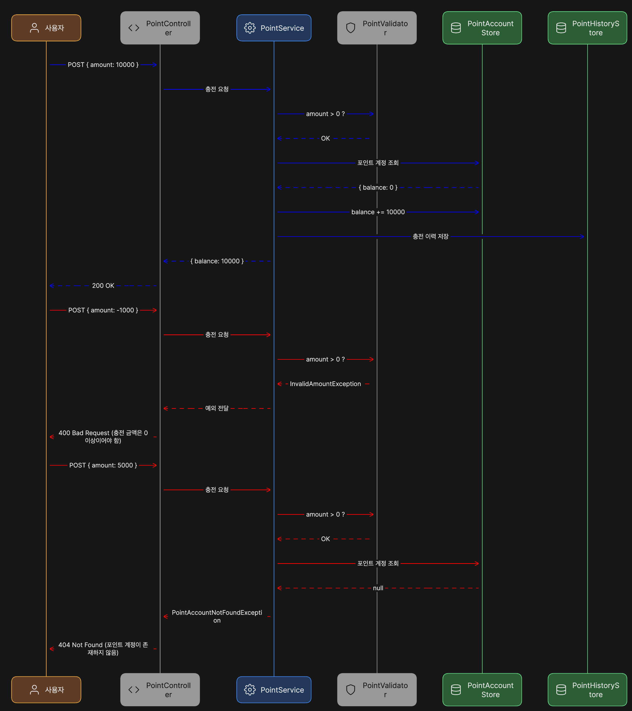
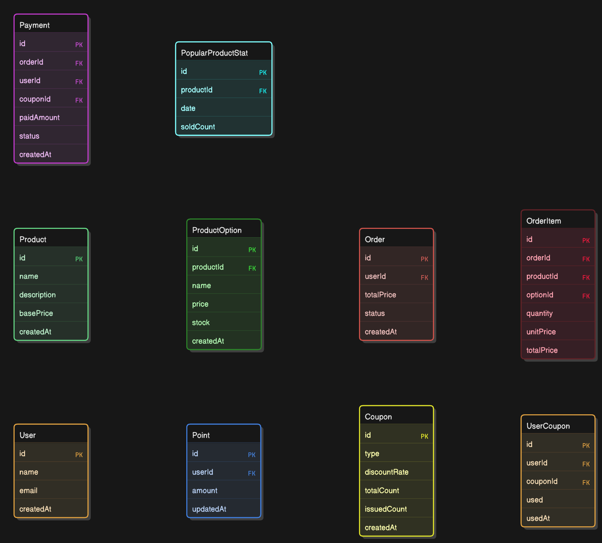
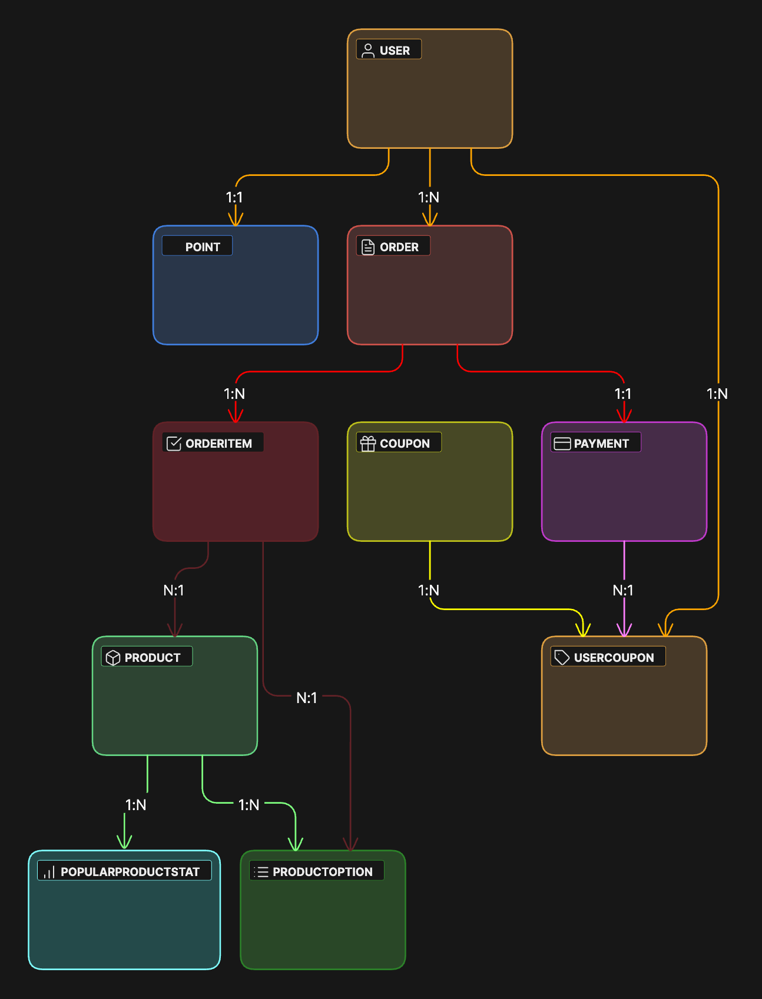

# 📘 e-Commerce 프로젝트: STEP 3 분석 과제 (NestJS 기반 설계)

> 항해 플러스 백엔드 8기 Chapter 2-1

---

## 과제 개요

- **목표:** e-Commerce 서비스의 주문/결제 흐름을 중심으로 시스템 아키텍처를 설계합니다.
- **핵심:** 도메인 분리, 유즈케이스 정의, 설계 문서화, API 명세를 통해 설계 능력을 입증합니다.
- **핵심 요구사항:**
  - 도메인 기반 시스템 구조 설계 (`User`, `Point`, `Product`, `Order`, `Payment`, `Coupon`, `Recommendation`)
  - 이벤트 기반 아키텍처 (OrderCreated → PaymentProcess 등)
  - 시퀀스 다이어그램 및 ERD 기반 기능 흐름 정의
  - API 명세(Swagger 어노테이션 기반) 구성
  - 동시성 제어 (선착순 쿠폰, 재고 차감, 포인트 동시 사용)
  - 확장성 (마이크로서비스 분리 고려)
---

## 프로젝트 마일스톤

| 단계      | 일정  | 주요 작업                                   | 산출물                                    |
| --------- | ----- | ------------------------------------------- | ----------------------------------------- |
| STEP 01   | Day 1 | 시나리오 선택, 요구사항 도출                | 기능/비기능 요구사항 정의서               |
| STEP 02   | Day 1 | 도메인 정의, 유스케이스 도출                | 도메인 구조, 유즈케이스 목록 (16개)       |
| STEP 03-1 | Day 2 | 설계 다이어그램 작성                        | 시퀀스 다이어그램, ERD, 클래스 다이어그램 |
| STEP 03-2 | Day 3 | 컨트롤러 Swagger 어노테이션 기반 명세 작성  | Controller Swagger 코드, 모듈 구성        |
| STEP 04   | Day 4 | Swagger 실행 환경 구성, Mock API 구현       | Swagger UI, main.ts 설정, DTO 정의        |
| STEP 05   | Day 5 | 실제 도메인 서비스/Repository/DTO 구현 시작 | 서비스 레이어 코드 작성                   |
| STEP 06   | Day 6 | E2E 테스트 코드 작성, 예외 상황 검증        | 테스트 케이스 코드, coverage 리포트       |
| STEP 07   | Day 7 | 문서화 정리, README, 회고 정리              | 최종 문서 및 제출 파일                    |

---

## 도메인 분류

| 서비스 분류     | 도메인 명        | 책임 설명                                   |
| --------------- | ---------------- | ------------------------------------------- |
| 유저 서비스     | `User`           | 사용자 정보 관리                            |
| 포인트 서비스   | `Point`          | 충전, 잔액 조회, 사용 내역 관리             |
| 상품 서비스     | `Product`        | 상품 및 옵션 관리, 재고 관리                |
| 장바구니 서비스 | `Cart`           | 장바구니 항목 CRUD                          |
| 주문 서비스     | `Order`          | 주문 생성, 조회, 취소                       |
| 결제 서비스     | `Payment`        | 결제, 포인트/쿠폰/재고 차감, 주문 상태 변경 |
| 쿠폰 서비스     | `Coupon`         | 쿠폰 발급/조회/사용 관리                    |
| 추천 서비스     | `Recommendation` | 인기 상품 집계 및 제공                      |

---

## 작성된 설계 문서

### 1. 유즈케이스 목록 (총 16개)

| 번호 | 유즈케이스            | 설명                                         |
| ---- | --------------------- | -------------------------------------------- |
| 1    | 포인트 충전           | 유저가 금액을 입력해 포인트 계정에 충전      |
| 2    | 포인트 조회           | 현재 잔액을 조회                             |
| 3    | 포인트 사용 내역 조회 | 충전/사용 히스토리 조회                      |
| 4    | 상품 목록 조회        | 전체 상품 및 옵션 리스트 반환                |
| 5    | 장바구니 담기         | 상품/옵션/수량 정보를 장바구니에 추가        |
| 6    | 장바구니 조회         | 유저의 장바구니 항목 전체 조회               |
| 7    | 장바구니 수정         | 장바구니 항목의 수량 변경                    |
| 8    | 장바구니 삭제         | 장바구니 항목 삭제                           |
| 9    | 주문 생성             | 장바구니 항목을 기반으로 주문 생성           |
| 10   | 주문 상세 조회        | 특정 주문에 대한 상세 내역 반환              |
| 11   | 주문 목록 조회        | 사용자의 모든 주문 히스토리 조회             |
| 12   | 주문 취소             | 생성된 주문을 취소 (상태 변경)               |
| 13   | 결제 처리             | 주문 ID, 쿠폰, 포인트 정보로 결제 수행       |
| 14   | 결제 내역 조회        | 사용자의 결제 내역 전체 조회                 |
| 15   | 쿠폰 발급             | 선착순 방식으로 쿠폰 발급 시도               |
| 16   | 인기 상품 조회        | 최근 3일 기준 가장 많이 팔린 상품 Top 5 조회 |

### 2. 시퀀스 다이어그램 (Eraser.io)
> 다이어그램에서 Repository는 사용하지 않으며 Store 수준으로 추상화됨 | 포인트, 쿠폰, 재고, 주문 상태 등은 각 Service 또는 Store 단에서 처리됨

- 각 유즈케이스별 정상 흐름 + 예외 흐름 포함
- 사용자 입력, validation, 예외명 명시
- 서비스 간 의존성을 EventBus 또는 Store를 통해 분리
- docs 폴더 참고

### 3. ERD 2종

- 필드 기반 ERD: PK/FK 및 실제 테이블 기반 관계 포함
  

- 도메인 흐름 기반 ERD: 도메인 단위 흐름 및 포함 관계 표현
  
  

---

## ✅ 제출 체크리스트 (STEP 3)

- [x] 전체 구현 마일스톤 작성
- [x] 기능 요구사항 분석 완료
- [x] 도메인 정의 완료
- [x] 유즈케이스 정리 (16개)
- [x] 시퀀스 다이어그램 (정상 + 예외 흐름)
- [x] ERD, 클래스 다이어그램 작성
- [] 컨트롤러 Swagger 명세 정의
- [] 모듈별 `*.module.ts` 구성 완료
- [] AppModule 통합 완료

> ⚠ Swagger UI 구현 및 Mock API 실행은 **STEP 4 과제**에서 수행됩니다.
